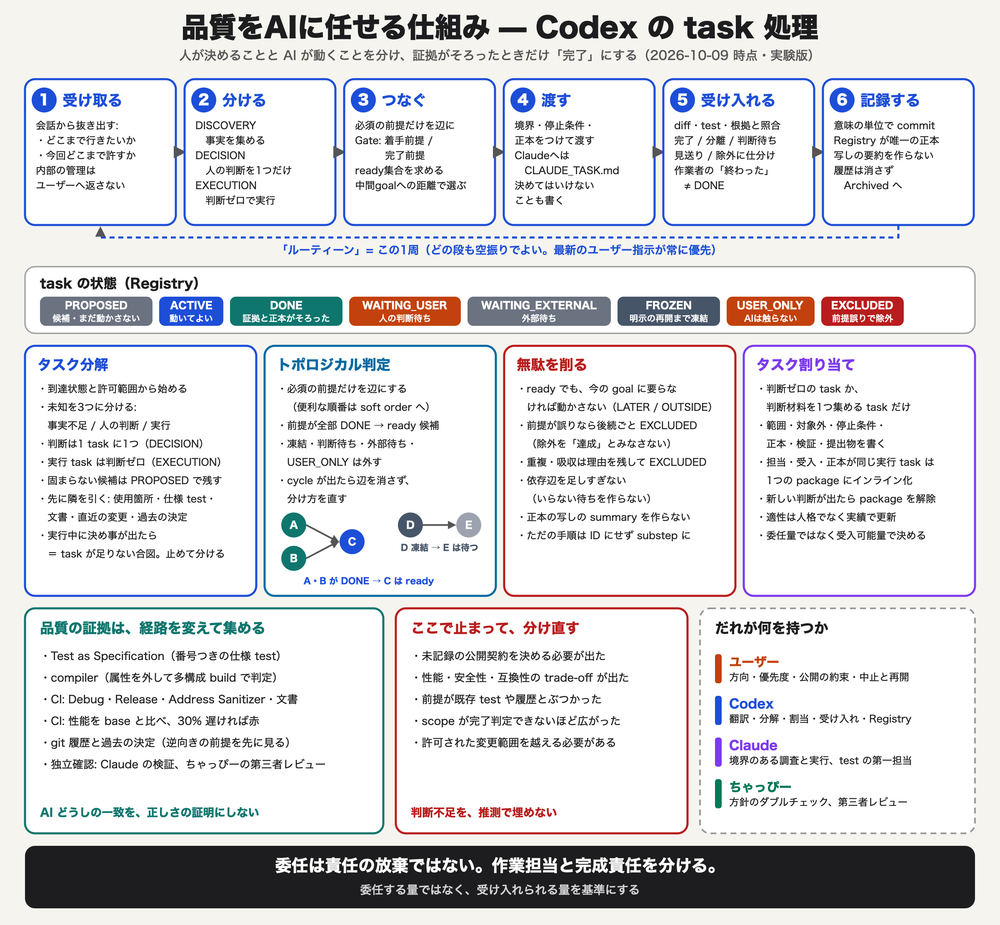

# Codex taskオリエンテーション

## 目的

この文書は、新しいCodexがTask Registryの形式を読むだけでなく、このrepositoryでtaskをどう考え、
なぜその分け方から次の行動が決まるのかを理解するための実践的な入口である。

詳細な運用規則は`CODEX_TASK_OPERATION_PLAYBOOK.md`を正とする。本書は規則の要約ではなく、会話から
中間ゴール、task、依存、判断、実行、受入へ変換する際の思考順序と、初回確認に使う事例を示す。

## task管理が解く問題

task管理の目的は、作業項目を多く登録することではない。仕事を適切に分けることで、次を担当者の勘や
会話の記憶に依存させず、記録された構造から導けるようにすることである。

- いま必要な事実は何か。
- agentが実行できる範囲はどこまでか。
- ユーザー判断が本当に必要か。
- どの作業を先に行わなければ後続が成立しないか。
- 依存上readyな作業のうち、現在の中間ゴールへ進むものはどれか。
- 何をもって成果を受け入れ、誰へ引き渡したら完了か。

分解の価値は作業量の縮小だけではない。事実確認、製品判断、実行、受入を別のnodeにすると、未確定な
一点だけを止め、独立して進められる部分を進め、不要になった判断を消せる。正しく分けられたtask graphは、
判断を代行しないが、判断が必要な場所と時期を明らかにする。

## 最初に中間ゴールを書く

taskを列挙する前に、現在の中間ゴールを到達状態として確認する。

- 悪い例: コメントを書く。
- 良い例: 全公開対象について、ユーザーが契約内容をレビューできるコメントドック・ドラフトを揃える。

良い中間ゴールは、作業方法ではなく、何が判断可能または引き渡し可能になるかを表す。これにより、
文章の最終校正、独立レビュー、公開可能な初版、release可否など、別段階の品質条件を勝手に混ぜずに済む。

中間ゴールはtaskではない。ID、担当、状態を持たず、`FROZEN`や`USER_ONLY`を開始する権限にもならない。

## 会話をtaskへ変換する順序

### 1. 到達状態と今回の権限を取る

ユーザーの言葉から、最終的に何を渡すのか、今回どこまで実行してよいのかを分ける。ユーザーが目的を
述べただけなら、branch作成、公開、push、不可逆操作まで許可されたと解釈しない。

### 2. 既存の決定と証拠を探す

「Codexが分からない」と「製品上の判断が未決である」は異なる。まず選択taskの詳細正本、Test as
Specification、実装、既存の決定を確認する。過去に決まっていること、事実確認で一意に決まること、
同型の採用済み原理から導けることを、ユーザー判断として返さない。

### 3. 未知を三つに分ける

- `DISCOVERY`: 事実、選択肢、依存、既存決定が不足している。
- `DECISION`: 証拠を閉じても複数の妥当な製品選択が残る。
- `EXECUTION`: 必要な判断が確定し、実装、文書化、検証だけが残る。

新しい疑問を見つけたこと自体は、`DECISION`を作る理由にならない。調査によって消える疑問を先に消し、
最後まで残った製品上の選択だけを、一判断一taskでユーザーへ渡す。

### 4. taskの成立条件を与える

各taskには、少なくとも目的、範囲、対象外、担当、詳細正本、完了条件、停止条件、必要な証拠、必須依存を
与える。これらが未確定なら`PROPOSED`であり、忘失防止の候補にすぎない。

### 5. 受入まで設計する

成果物を作ったことと、taskの完了は同じではない。検証結果、既知の未確認事項、正本との整合、引き渡し先を
確認する。担当agentの「完了」や、test・DocCの成功だけで完成判定しない。一方、中間ゴールがレビュー可能な
ドラフトの引き渡しなら、ユーザーによる実レビューや公開可能な初版を余分な完了条件にしない。

## 分からないときの処理

次の順で絞る。

1. 現行実装とTest as Specificationから事実を確認する。
2. Registryと詳細正本から、既存の決定、凍結、後続phaseを確認する。
3. 同型の事例に適用できる採用済み原理があるか確認する。
4. 比較対象、選択肢、各選択の影響を明らかにする。
5. 証拠不足なら`DISCOVERY`へ戻す。
6. 結論が一意ならCodexが処理し、`EXECUTION`へ渡す。
7. 複数の妥当な製品選択が残る場合だけ、一判断の`DECISION`を登録する。

ユーザーへ返す問いには、「何と比べて」「なぜ既存証拠では決まらず」「答えがどの後続taskを変えるか」を
含める。質問を作れないなら、まだ調査または分解が不足している可能性が高い。

## 依存を張る

Task precedenceには、後続taskの成立に不可欠なAND依存だけを書く。

- `SEQUENCE`: 前提成果なしには後続を開始できない。
- `PARALLEL_JOIN`: 独立部分は先行できるが、後続の完成前に前提成果との合流が必要。

便利な順番、同じfileを触ること、同じgoalに属することは必須依存ではない。推奨順はsoft orderとして扱う。
cycleが出た場合は辺を都合よく無視せず、task分割、親子関係、相互判断の誤りとして停止する。

上流判断によって後続の必要性が消えた場合、後続を惰性で実行しない。依存辺、完了条件、task状態を更新し、
ready集合を計算し直す。

## readyとnextを区別する

依存上readyであることは、現在必要または次に行うべきことを意味しない。

1. `SEQUENCE`前提がすべて`DONE`か確認する。
2. `PROPOSED`、`FROZEN`、`WAITING_USER`、`WAITING_EXTERNAL`、`USER_ONLY`を除く。
3. 最新のユーザー指示、担当、再開条件を確認する。
4. 現在の中間ゴールへの距離を評価する。

| 距離 | 意味 |
| --- | --- |
| `DIRECT` | 完了により現在のゴールの一部を直接閉じる、または判断可能にする |
| `NEAR` | `DIRECT`な仕事に必要な入力 |
| `FAR` | 現在のゴールに必要だが、複数の中間taskやgateを経る |
| `LATER` | 明示された後続ゴールまたは後続phaseに属する |
| `OUTSIDE` | 記録されたゴールへ寄与しない |

必要な`DIRECT`、`NEAR`、`FAR`から、critical path、risk、soft order、受入可能量を見て次を選ぶ。有用、
興味深い、品質向上に役立つというだけで、`LATER`や`OUTSIDE`を現在の仕事にしない。

## このrepositoryでの実例

### OptionalArrayの命名と0.5.2ドラフト

「現行契約をコメントへ記載する」と「公開型名を将来も維持する」を一つにすると、命名判断が終わるまで
0.5.2のドラフトを開始できないように見える。分解すると、現行名によるレビュー用ドラフトは0.5.2の
`EXECUTION`として進められ、名称の最終判断は公開可能な初版を扱う0.6.0ゲートへ合流できる。

この例で重要なのは、依存を後ろへ動かして作業を便利にしたことではない。0.5.2と0.6.0の到達条件を読み、
命名確定がどちらの成果成立に本当に必要かを確認した結果、元の依存が過剰だと分かったことである。

### RedBlackTreeのドラフトと仕上げ

RedBlackTreeは既存の公開コメント監査とHead原稿により、0.5.2が求めるレビュー可能なドラフトへ到達している。
一方、高品質な利用者向け文書への仕上げは、Permutation、OptionalArray、BareArrayで作業方式を習熟した後、
最後に扱う。この二つを別task・別goalに置くことで、「到達済みだが最後に回す」を矛盾なく表現できる。

### 独立レビューの距離

独立レビューは品質上有用でも、現在の中間ゴールの必須条件とは限らない。レビュー可能なドラフトを渡す
段階では、release可否ゲートで必要になる独立確認は`FAR`であり、現在の`NEAR`な執筆を止めない。品質上の
有用性と、現在のgoalへの近さを混同しない。

## ユーザーとCodexの境界

ユーザーが保持するもの:

- 製品方針、公開契約、品質基準、優先順位。
- 中止・再開、不可逆操作、外部への公開。
- 証拠を閉じても残る製品上の選択と最終accountability。

Codexが引き取るもの:

- 会話からtask境界、型、依存、担当、完了条件への翻訳。
- 既存決定と証拠の確認、ready集合とgoal距離の評価。
- 判断不要な実行、委任、検収、Registry更新、commit境界。
- ユーザーへ返す判断を、本当に残った一件へ絞ること。

内部のID、状態、handoff、依存表をユーザーに操作させない。ユーザーが「次は？」と聞いたら、Codexが
Registryと正本を読み、現在の結果、その意味、次の作業、必要なら一つの判断へ翻訳して答える。

## 事故または会話消失後の復帰

1. `AGENTS.md`の起動規則に従う。
2. `PROGRESS_OVERVIEW.md`のTask Registryだけから現在の中間ゴールとtask状態を確認する。
3. 選択したtaskの詳細正本だけを読む。
4. worktree、HEAD、直近commitを確認し、未commit変更の所有を推測しない。
5. taskの型、完了条件、必須依存、距離を自分の言葉で再構成する。
6. 古いhandoffやArchived記録は、具体的な矛盾または失われた判断根拠を調べる場合だけ読む。
7. 記録から導けない製品判断だけをユーザーへ返す。

規則を読めたことと、判断順序を復元できたことは同じではない。復帰後は、下の確認事例でtaskの分け方を
説明できるか確認する。

## 初回理解の確認

次の問いへ、Registryの状態名を読み上げるだけでなく理由を説明できることを確認する。

1. なぜOptionalArrayの命名判断を0.5.2コメントドックの前提から外せたのか。
2. なぜRedBlackTreeはドラフト到達済みでも、利用者向け文書の仕上げを最後に回せるのか。
3. なぜClaudeの独立レビューは品質上有用でも、コメントドック・ドラフト作成の次taskではなかったのか。
4. 「Sendableが気になる」のような疑問を、なぜ直ちにユーザー判断へ変えてはいけないのか。
5. 依存上readyなtaskが複数あるとき、何を根拠にnextを選ぶのか。
6. `EXECUTION`中に新しい公開契約の選択が見つかったとき、なぜ実装を続けてはいけないのか。

期待する理解は用語の暗記ではない。分解によって、事実確認で消える疑問、Codexが実行できる仕事、
ユーザーだけが決める仕事、後続phaseへ送る仕事を区別し、現在の中間ゴールへ必要な次taskを説明できる
ことである。

## 詳細な参照先

- `CODEX_ORIENTATION.md`: 司令塔としての責任、証拠、復帰の全体像
- `CODEX_TASK_OPERATION_PLAYBOOK.md`: task作成、依存、状態、委任、受入の詳細規則
- `PROGRESS_OVERVIEW.md`: 現在の中間ゴール、task、状態、必須依存の正本
- `PROGRESS_OVERVIEW_TEMPLATE.md`: 別projectへ移植するときのRegistry雛形
- `Graph/TASK_GRAPH_LINT.md`: graphが機械的に検査できる範囲と、判断を代行しない境界
- `AI_TASK_PROCESS_POSTER.png`: task処理全体の視覚的な要約

## 作成記録

- Registry task: `OPS-005`
- 目的: task運用の規則ではなく、判断順序と分解効果を初回に理解できる入口を作る。
- 境界: 現行taskの状態を本書へ複製せず、現在地はTask Registryだけを正とする。
- 由来: この方式は一人のagentが設計したものではない。ユーザーが中間ゴール、責任境界、判断の返し方を
  実作業の中で修正し、Codexがtask分解、依存、受入、正本へ統合し、Claudeが境界付きの実行と独立した
  反証から分解の不足や運用上の弱点を明らかにした。三者の反復から得た知見を、事故やconversation交代後も
  利用できる形へまとめたものである。
